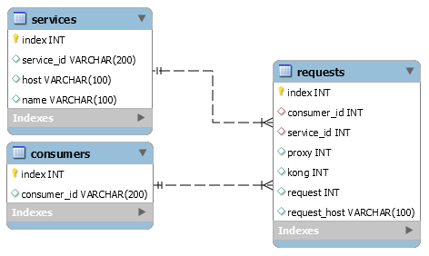

## Tabela Requisições

|       id     |       consumer_id            |    "service_id"            | "proxy"             | "kong"              | "request"           |    "request_host"  |
|:------------:|:----------------------------:|:--------------------------:|:-------------------:|:-------------------:|:-------------------:|:------------------:|
|        1     |[1](TabelaConsumidor.md#id)|[1](TabelaServicos.md#id)|[1752](Latencia.md#proxy)|[10](Latencia.md#kong)|[2574](Latencia.md#request)|["httpbin.org"](Request.md#host)|

### id(primary)
- 1
- 2
- ...

### consumer_id
- 63eec8c8-fb0f-38dd-9b9b-90eb4e3f7658
- 650b0170-92e4-383d-bd31-a9b5422221fb
- ...

### service_id
- 63eec8c8-fb0f-38dd-9b9b-90eb4e3f7658
- 650b0170-92e4-383d-bd31-a9b5422221fb
- ...

### proxy
- 1727
- 1968
- ...

### kong
- 10
- 8
- ...

### request
- 2185
- 1185
- ...

### request_host
- "httpbin.org"
- "corw.org"
- ...