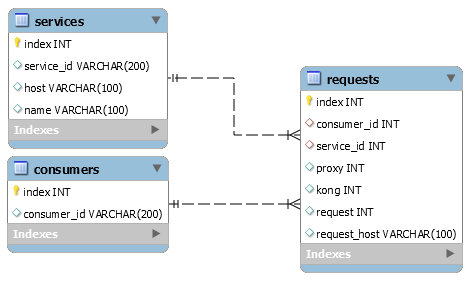

para visualizar de forma melhor como as ideias se relacionam use o software [Obsidian](https://obsidian.md/) onde pode ser visto de melhor forma e até de forma gráfica como as ideias se conectam.

abra a pasta docs como um Vault no obsidian.

### Tecnologias

- Python
- MySQL

--------------

### Instruções

O arquivo [logs.txt](https://drive.google.com/open?id=1GliYD4Q19_f6S88iFsn0dk8dGLhB9YXF) contém informações de log geradas por um sistema gateway, cada solicitação foi registrada em um objeto JSON separado por uma nova linha `\n`, com o seguinte formato:

#### [JSON](JSON.md)
```json
{
    "request": {
        "method": "GET",
        "uri": "/get",
        "url": "http://httpbin.org:8000/get",
        "size": "75",
        "querystring": {},
        "headers": {
            "accept": "*/*",
            "host": "httpbin.org",
            "user-agent": "curl/7.37.1"
        },
    },
    "upstream_uri": "/",
    "response": {
        "status": 200,
        "size": "434",
        "headers": {
            "Content-Length": "197",
            "via": "kong/0.3.0",
            "Connection": "close",
            "access-control-allow-credentials": "true",
            "Content-Type": "application/json",
            "server": "nginx",
            "access-control-allow-origin": "*"
        }
    },
    "authenticated_entity": {
        "consumer_id": "80f74eef-31b8-45d5-c525-ae532297ea8e"
    },
    "route": {
        "created_at": 1521555129,
        "hosts": null,
        "id": "75818c5f-202d-4b82-a553-6a46e7c9a19e",
        "methods": ["GET","POST","PUT","DELETE","PATCH","OPTIONS","HEAD"],
        "paths": [
            "/example-path"
        ],
        "preserve_host": false,
        "protocols": [
            "http",
            "https"
        ],
        "regex_priority": 0,
        "service": {
            "id": "0590139e-7481-466c-bcdf-929adcaaf804"
        },
        "strip_path": true,
        "updated_at": 1521555129
    },
    "service": {
        "connect_timeout": 60000,
        "created_at": 1521554518,
        "host": "example.com",
        "id": "0590139e-7481-466c-bcdf-929adcaaf804",
        "name": "myservice",
        "path": "/",
        "port": 80,
        "protocol": "http",
        "read_timeout": 60000,
        "retries": 5,
        "updated_at": 1521554518,
        "write_timeout": 60000
    },
    "[latencies](Latencia.md)": {
        "proxy": 1430,
        "kong": 9,
        "request": 1921
    },
    "client_ip": "127.0.0.1",
    "started_at": 1433209822425
}
```

***Algumas considerações sobre o objeto JSON acima:***

`latencies` contém alguns dados sobre as latências envolvidas:
- `proxy`  é o tempo levado pelo serviço final para processar a requisição.
- `kong`  é a latência referente a execução de todos os plugins pelo Kong (gateway).
- `request`  é o tempo decorrido entre o primeiro byte ser lido do cliente e o último byte ser enviado a ele. Útil para detectar clientes lentos.

--------------

### Requisitos
- Processar o arquivo de [log](JSON.md), extrair informações e salvá-las em um banco de dados.
- Estruturar esse [banco](DatabaseModel.md) de forma relacional.
- Buscar a normalização desse banco de dados.

- Gerar um relatório para cada descrição abaixo, em formato csv: 
	- [Requisições](Request.md) por [consumidor](TabelaConsumidor.md);
		- Principais caracteristicas de [Consumidor](Consumidor.md)
 
	- Requisições por [serviço](TabelaServicos.md);
		- Principais caracteristicas de [servico](servico.md)
 
	- Tempo médio de request, proxy e kong por serviço.
		- Principais caracteristicas de [Latencia](Latencia.md)
 
- Documentar passo a passo de como executar o teste através de um arquivo [README.md](README.md).
- Efetue o `commit` de todos os passos do desenvolvimento em um ***git público*** de sua preferência e disponibilize apenas o link para o repositório.
